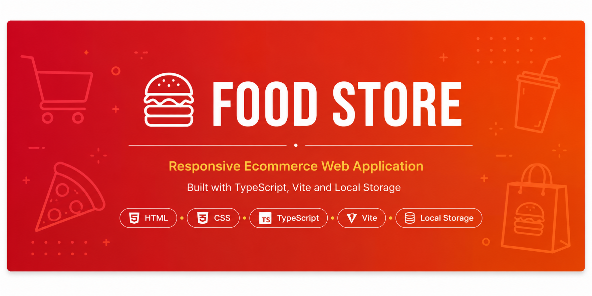
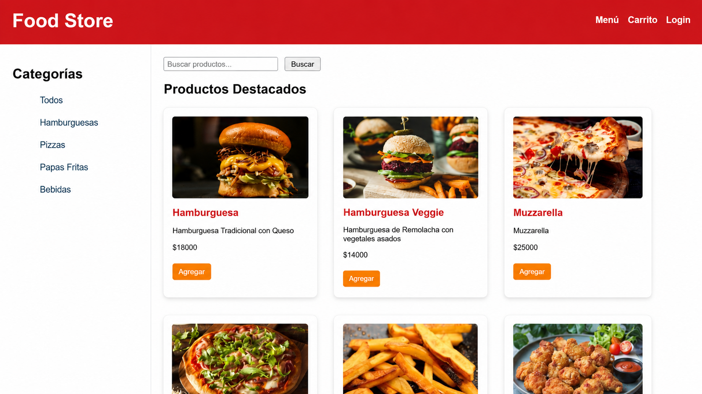
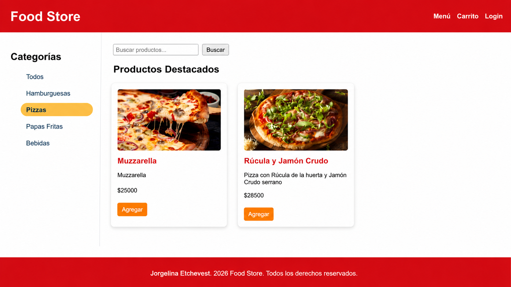
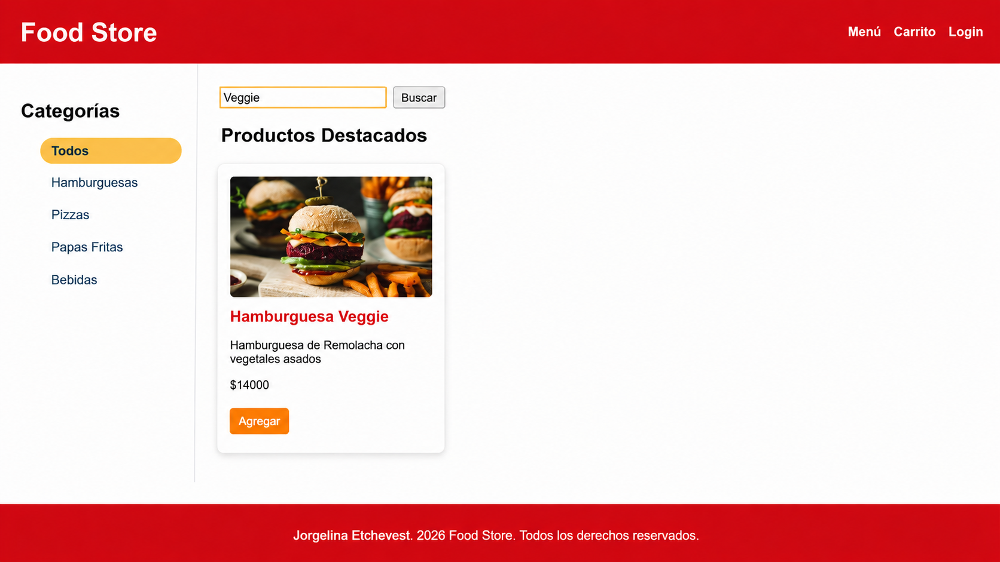
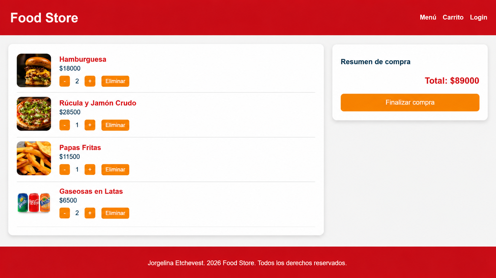

# Food Store

Responsive Ecommerce Web Application built with TypeScript, Vite, HTML5, CSS3 and Local Storage.

---

## Overview

Food Store is a responsive ecommerce web application that simulates the core functionality of an online grocery store.

The application allows users to browse products, filter items by category, perform keyword searches, manage a shopping cart and persist purchase information using Local Storage.

Originally developed as an academic project for the Programming III course at the National Technological University (UTN), this repository was later refactored, documented and improved as part of my professional software development portfolio.

---

## Live Demo

Coming soon.

---

## Key Features

- Dynamic product catalog
- Product search by keyword
- Category filtering
- Shopping cart management
- Quantity update and item removal
- Automatic purchase total calculation
- Persistent shopping cart using Local Storage
- Responsive user interface

---

## Tech Stack

| Technology | Purpose |
|------------|----------|
| HTML5 | Structure |
| CSS3 | Styling |
| TypeScript | Application Logic |
| Vite | Development Environment |
| Local Storage | Client-side Persistence |

---

## Screenshots

### Home



---

### Category Filter



---

### Product Search



---

### Shopping Cart



---

## Project Structure

```text
src/
│
├── data/
│
├── types/
│
├── pages/
│   ├── home/
│   ├── cart/
│   └── login/
│
public/
│
docs/
└── screenshots/
```

---

## Installation

Clone the repository

```bash
git clone https://github.com/Jorgelina-Etchevest/food-store-programacion3.git
```

Install dependencies

```bash
npm install
```

Run the development server

```bash
npm run dev
```

Open

```
http://localhost:5173
```

---

## Skills Demonstrated

- Frontend Development
- TypeScript
- Responsive Web Design
- DOM Manipulation
- State Management
- Local Storage
- Modular Project Structure
- User Interface Development

---

## Future Improvements

- User authentication
- Product detail page
- Checkout process
- Backend integration
- Database persistence
- Payment gateway integration

---

## Author

**Jorgelina Etchevest**
Economist | Data Analytics | Business Intelligence


---

## License
This project is licensed under the MIT License.
